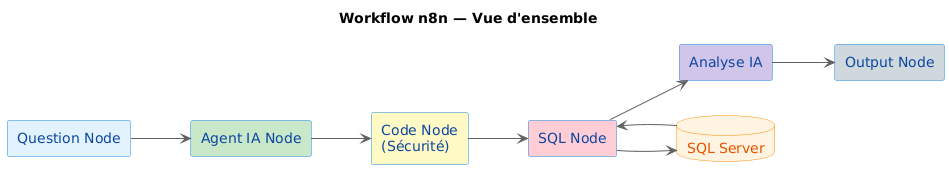
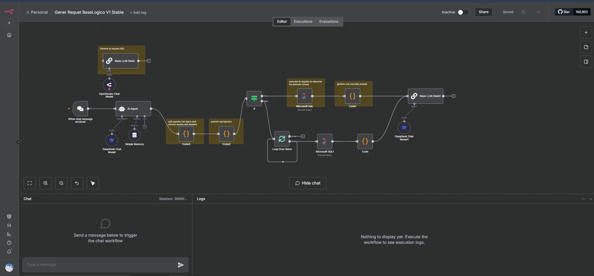

# Industrial Data Analysis Automation with n8n

## Overview

This project provides an **automated workflow for secure industrial data analysis** using n8n.  
The workflow allows users to translate **natural language queries into SQL**, execute them on a database, and present the results in a **readable format**.

The system integrates:

- A **language model (LLM)** for interpreting natural language queries
- A **security verification module** to filter unsafe SQL queries
- An **analysis and presentation module** to display results clearly

This workflow demonstrates how **automation and AI** can simplify data access and make industrial data more actionable.

---


## Features

- Secure SQL query generation from natural language
- Integration with SQL Server
- Automated workflow orchestration via n8n
- Clear presentation of query results
- Portable and reproducible using Docker

---



## Prerequisites

- Docker
- Docker Compose
- SQL Server (or compatible database)

---

## Installation

1. Clone the repository:

```bash
git clone https://github.com/YOUR_USERNAME/n8n-industrial-data-analysis.git
cd n8n-industrial-data-analysis

```

2. Copy .env.example to .env:

```bash
copy .env.example .env   # Windows
# or
cp .env.example .env     # Linux/Mac
```

3. Edit .env with your database credentials.

Start n8n via Docker:
 ```bash
docker compose up -d
```

4. Open the n8n editor in your browser:

http://localhost:5678